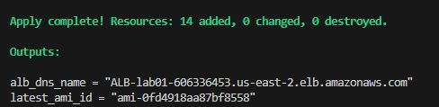

# Cluster de Alta Disponibilidade com EC2 na AWS usando Application Load Balancer e Auto Scaling Group

## Configuração da Rede

Primeiramente, criamos todos os recursos de rede, incluindo uma VPC, duas sub-redes em zonas de disponibilidade diferentes, tabelas de rotas e um Internet Gateway para acesso à internet.

## Auto Scaling Group 

Configuramos um template com definições padrões para instâncias EC2, com a execução de um script padrão para a instalação do Apache, usando a AMI mais recente do Amazon Linux.

Criamos o Auto Scaling Group, que inicia pelo menos duas instâncias EC2 e permite um máximo de quatro. Também configuramos uma verificação de integridade (Health Check) das instâncias EC2, que as substituirá se não estiverem íntegras.

## Application Load Balancer

Configuramos os recursos relacionados ao Application Load Balancer (ALB). Primeiro, criamos o ALB (aws_lb), que é responsável pelo balanceamento de carga. Em seguida, configuramos o target group (aws_lb_target_group) para controlar o roteamento de solicitações de tráfego para as instâncias de destino. Por último, definimos o listener (aws_lb_listener) para direcionar o tráfego de entrada do balanceador de carga para os grupos de destino (target groups) ou instâncias de destino.

## Camada de Segurança

Configuramos dois grupos de segurança (Security Groups). Um deles restringe o tráfego para somente HTTPS e HTTP no Application Load Balancer, enquanto o outro permite que as instâncias EC2 recebam requisições apenas do Load Balancer.

Security Group para o Load Balancer:

Security Group para as Instâncias EC2:

## Evidências de Funcionamento

